# 🏡 Realty Zone 

## 📋 Spis treści
1. [Wprowadzenie](#1-wprowadzenie)
2. [Użyte technologie](#2-technologie)
3. [Funkcjonalności](#3-funkcjonalności)
4. [Instalacja projektu](#4-instalacja-projektu)
5. Pozostałe:
    1. [Licencja](#licencja)
    2. [Kontakt](#kontakt)


## 1. Wprowadzenie
**Realty Zone** to nowoczesny portal z ogłoszeniami nieruchomości, który ułatwia użytkownikom dodawanie, przeglądanie i zarządzanie ogłoszeniami dotyczącymi nieruchomości. Portal skupia się na oferowaniu wygodnej i przyjaznej dla użytkownika platformy, która pozwala na szybkie i łatwe dodawanie ogłoszeń z poziomu zarejestrowanego użytkownika.

Celem projektu **Realty Zone** jest stworzenie wydajnej i przyjaznej dla użytkownika platformy do publikowania i przeglądania ogłoszeń nieruchomości. Moja wizja obejmuje ciągłe doskonalenie funkcjonalności portalu, dostosowywanie go do zmieniających się potrzeb rynku oraz tworzenie społeczności zaangażowanych użytkowników, którzy aktywnie korzystają z naszych usług.

## 2. Technologie

### Frontend


### Backend


## 3. Funkcjonalności

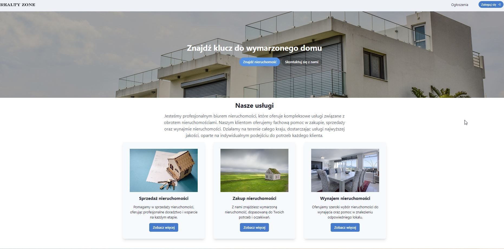

### Zaimplementowane funkcjonalności
**Rejestracja użytkownika:** Użytkownicy mogą się zarejestrować, aby uzyskać dostęp do swojego konta i korzystać z pełnej funkcjonalności portalu.
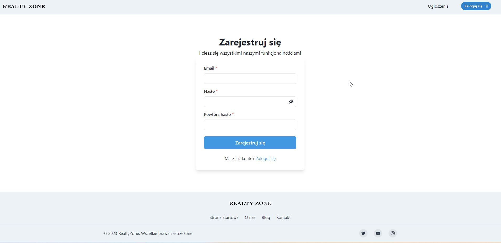
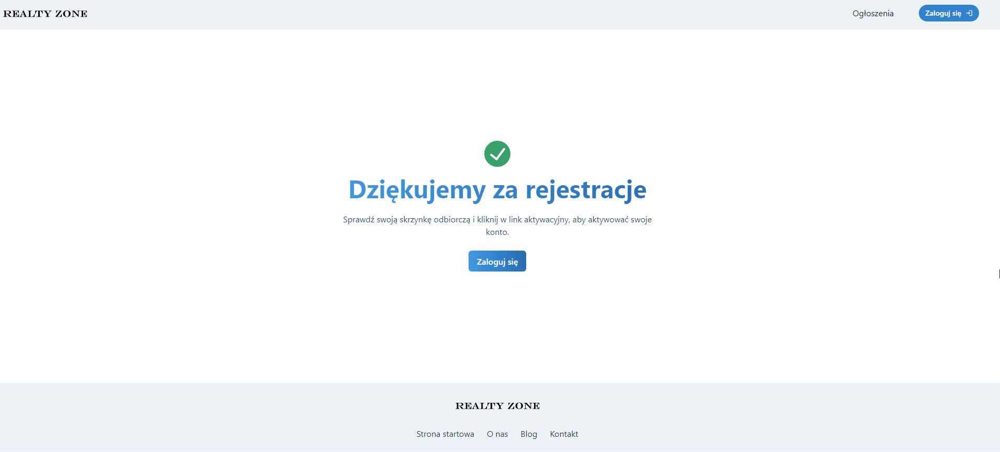

**Wysłanie maila z linkiem aktywacyjnym:** Po rejestracji, użytkownik otrzymuje wiadomość e-mail z linkiem aktywacyjnym, który pozwala na weryfikację konta.
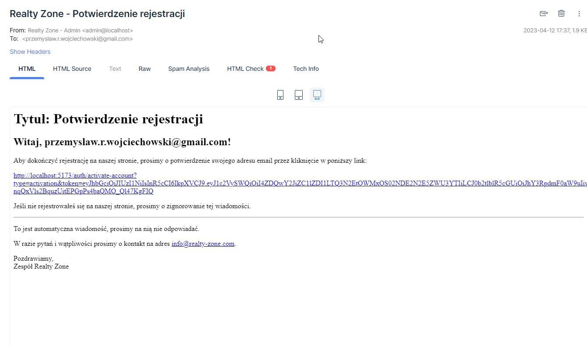
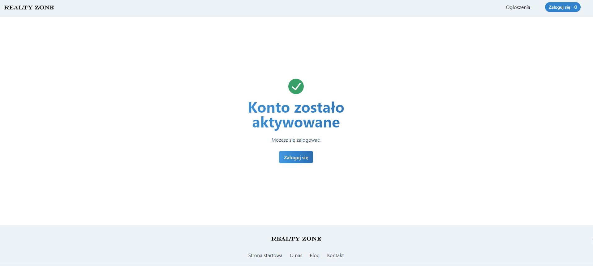

**Logowanie użytkownika:** Użytkownicy mogą się logować do swoich kont, aby korzystać z funkcji dostępnych tylko dla zalogowanych użytkowników.
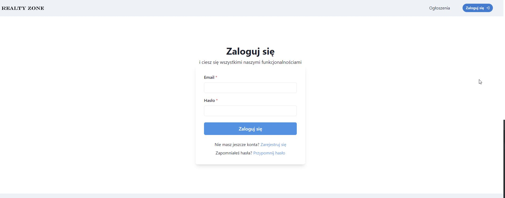

**Dodawanie ogłoszeń przez zarejestrowanych użytkowników:** Zarejestrowani użytkownicy mogą dodawać ogłoszenia dotyczące nieruchomości, wraz z opisem, zdjęciami i innymi szczegółami.
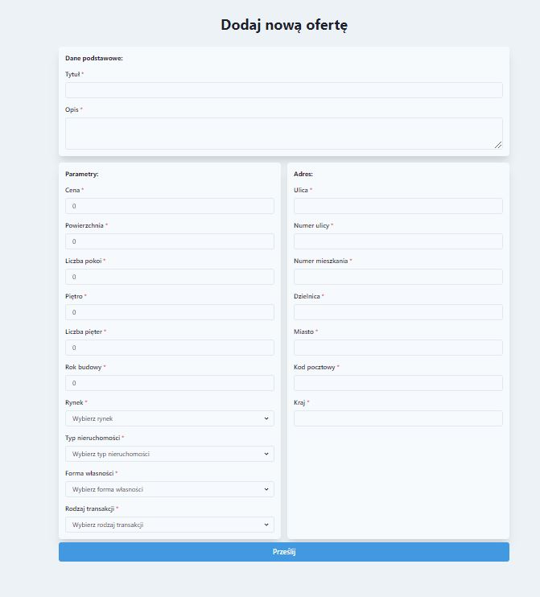
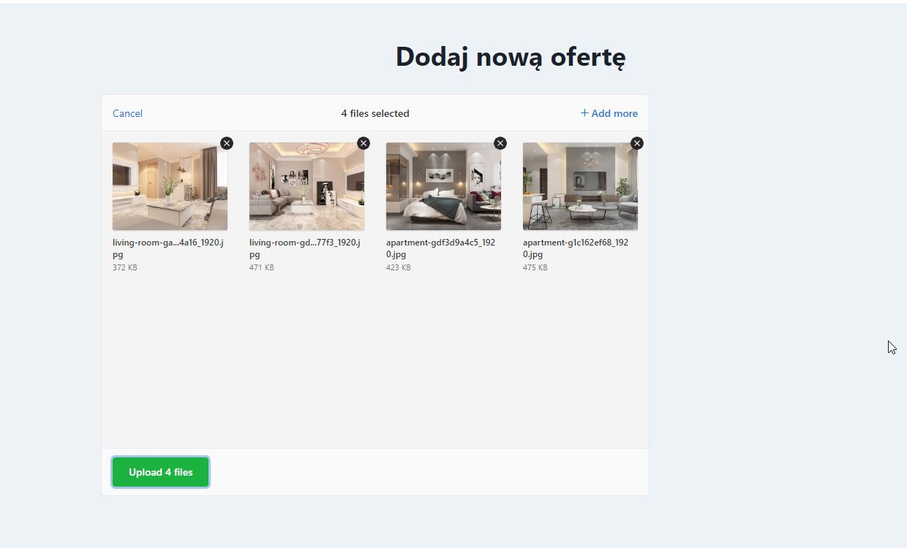

**Uzupełnienie profilu użytkownika:** Zarejestrowani użytkownicy mogą uzupełniać swoje profile o dodatkowe informacje.
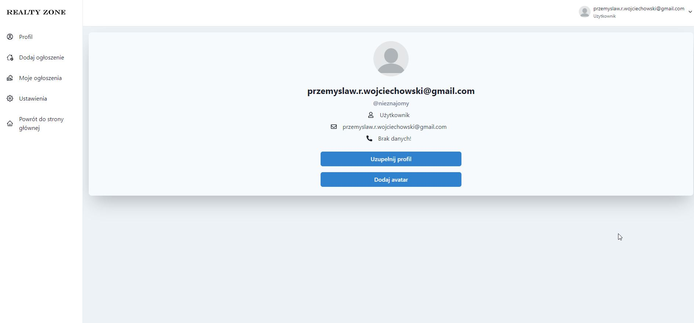
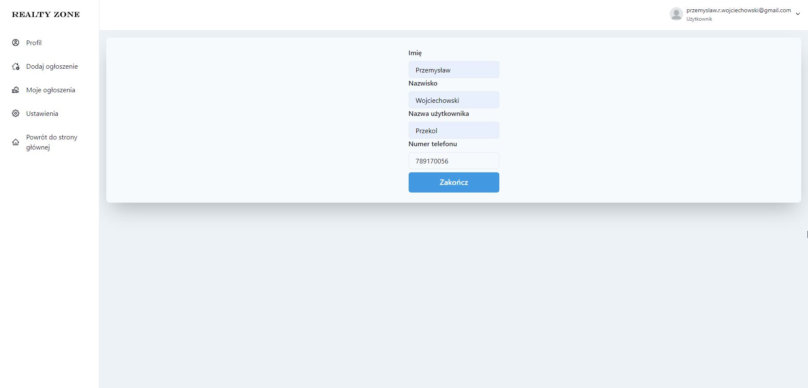
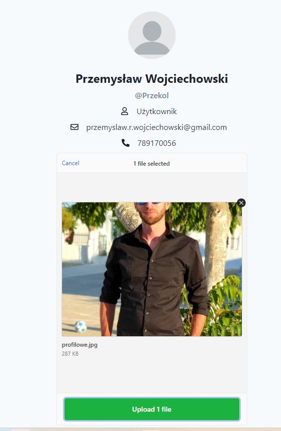


**Przeglądanie ogłoszeń przez wszystkich użytkowników:** Zarówno zarejestrowani użytkownicy, jak i niezarejestrowani goście mają możliwość przeglądania dodanych ogłoszeń dotyczących nieruchomości na portalu.
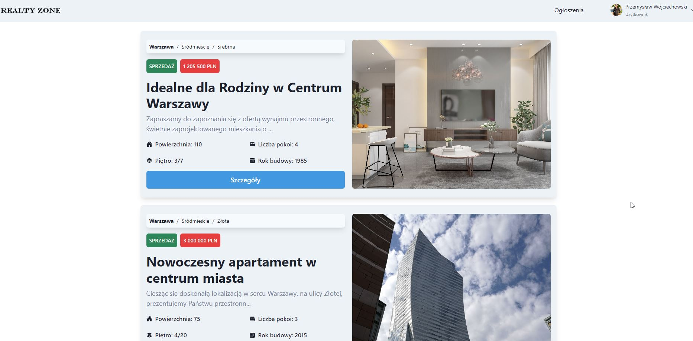
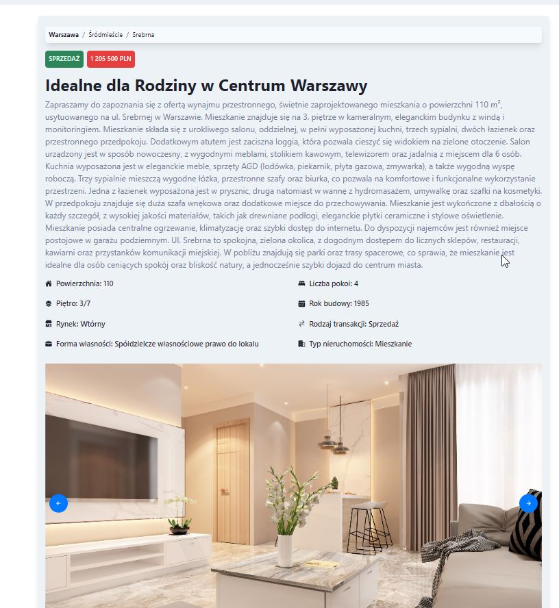

### Funkcjonalności, których nie udało się zaimplementować
**Obsługa na froncie przypomnienia i resetowania hasła:** Użytkownicy nie mają jeszcze możliwości przypominania sobie hasła ani resetowania go przez panel użytkownika.

**Edycja ogłoszeń:** Zarejestrowani użytkownicy nie mają możliwości edytowania swoich ogłoszeń po ich dodaniu.

**Usuwanie ogłoszeń:** Użytkownicy nie mają możliwości usuwania swoich ogłoszeń z portalu.

**Formularz kontaktowy do konkretnego ogłoszenia:** Brak formularza kontaktowego, który pozwalałby użytkownikom bezpośrednio wysyłać zapytania do sprzedawców lub właścicieli nieruchomości dotyczących konkretnego ogłoszenia.

**Wdrożenie aplikacji na serwer:** Niestety, nie udało się przeprowadzić procesu wdrożenia aplikacji na serwer zdalny. W związku z tym, nie można obecnie korzystać z aplikacji online. W przyszłości planowane jest poprawienie tej kwestii i umożliwienie dostępu do aplikacji przez internet.

## 4. Instalacja projektu

### I. Klonowanie z GitHub 
1. Otwórz terminal i sklonuj repozytoria, wykonując poniższe polecenia:
    ```bash  
   $ git clone https://github.com/Przekol/realty-zone-backend.git
   $ git clone https://github.com/Przekol/realty-zone-frontend.git
    ``` 
2. Przejdź do katalogu `realty-zone-backend`:
    ```bash 
   $ cd realty-zone-backend
    ```
3. Stwórz pliki `.env` oraz `docker.env` w katalogu `realty-zone-backend` i ustaw swoje zmienne środowiskowe na podstawie pliku `.env.example` i `docker.env`.
Zwróć szczególną uwagę na zmienne dotyczące poczty.
   ```
   EMAIL_HOST=
   EMAIL_USER=
   EMAIL_PORT=
   EMAIL_PASSWORD=
   ```
   W tym celu polecam skorzystać z darmowego konta na https://mailtrap.io/.

### II. Uruchomienie bazy danych PostgreSQL
##### _1. Instalacja bazy danych na komputerze_:
   1. Pobierz i zainstaluj najnowszą wersję bazy danych PostgreSQL ze strony https://www.postgresql.org/download/.
   2. Po zakończeniu instalacji otwórz program `pgAdmin`.
   3. W programie `pgAdmin` kliknij prawym przyciskiem myszy na pozycję `Servers` i wybierz opcję `Create` > `Server...`.
   4. W oknie `Create - Server` wprowadź nazwę serwera (np. "realty-zone-db") i kliknij przycisk `Connect`.
   5. Jeśli połączenie zostanie nawiązane pomyślnie, baza danych PostgreSQL zostanie uruchomiona i będzie dostępna do użytku.
##### _2. Uruchomienie bazy danych w kontenerze Docker_:
   1. Upewnij się, że masz zainstalowany Docker na swoim komputerze. Jeśli go jeszcze nie masz, możesz go pobrać ze strony https://www.docker.com/.
   2. Otwórz terminal i przejdź do katalogu `realty-zone-backend`, w którym znajduje się plik `db-docker-compose.yml`.
   3. Aby utworzyć kontener, wykonaj jedno z poleceń:
   ```bash
    # Utworzenie i uruchomienie w kontenerze o nazwie "database" w terminalu
    $ docker compose -f db-docker-compose.yml -p database up 
   ```
   ```bash 
   # Utworzenie i uruchomienie w kontenerze o nazwie "database" w tle
   $ docker compose -f db-docker-compose.yml -p database up -d
  ```
  Kontener zostanie automatycznie uruchomiony po jego utworzeniu.

### III. Uruchomienie aplikacji
1. Otwórz terminal, przejdź do katalogu `realty-zone-backend` i zainstaluj zależności, wykonując polecenie:
    ```bash 
   $ npm install
    ```
2. Uruchom aplikacje backendową:
    ```bash 
   $ npm start
    ```
3. Następnie otwórz terminal w katalogu `realty-zone-frontend` i zainstaluj zależności, wykonując polecenie:
    ```bash 
   $ npm install
    ```
4. Uruchom aplikację frontendową:
    ```bash 
   $ npm run dev
    ```
- serwer backendowy zostanie uruchomiony pod adresem: http://localhost:3001
- serwer frontendowy zostanie uruchomiony pod adresem: http://localhost:5173
   


## 5. Docker - uruchomienie aplikacji

1. Upewnij się, że masz zainstalowanego Docker na swoim komputerze. Jeśli go jeszcze nie masz, możesz go pobrać ze strony https://www.docker.com/.
2. Wykonaj polecenia z części [I. Klonowanie z GitHub](#i-klonowanie-z-github)
3. Otwórz terminal i przejdź do katalogu `realty-zone-backend`, w którym znajduje się plik `docker-compose.yml`. 
4. Aby utworzyć kontener, wykonaj jedno z poleceń:
    ```bash
    # Utworzenie i uruchomienie kontenera o nazwie "realty-zone" w terminalu
    docker compose -p realty-zone up
   ```
   ```bash
   # Utworzenie i uruchomienie kontenera w tle
   docker compose -p realty-zone up -d
    ```

    Kontener zostanie automatycznie uruchomiony po jego utworzeniu.

5. Inne polecenia przydatne w dalszej pracy z kontenerem:
     ```bash
     # Wyłączenie kontenera (bez usunięcia go z pamięci)
     docker compose -p realty-zone stop
    ```
    ```bash
    # Uruchomienie kontenera (już po wcześniejszym utworzeniu)
    docker compose -p realty-zone start
     ```
   ```bash
    # Usunięcie kontenera z pamięci
    docker compose -p realty-zone down
     ```

## 6. Pozostałe

### Licencja

[MIT](https://choosealicense.com/licenses/mit/)


### Kontakt
E-mail: [Przemysław Wojciechowski](mailto:przemyslaw.r.wojciechowski@gmail.com)
#### 🌐 Socials:
[](https://github.com/przekol)
[](https://twitter.com/przemyslaw_woj) [](https://www.linkedin.com/in/przemyslaw-wojciechowski/) [](https://facebook.com/przemek.wojciechowski.184/)
[](https://www.buymeacoffee.com/przekol)
